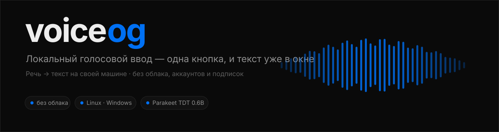
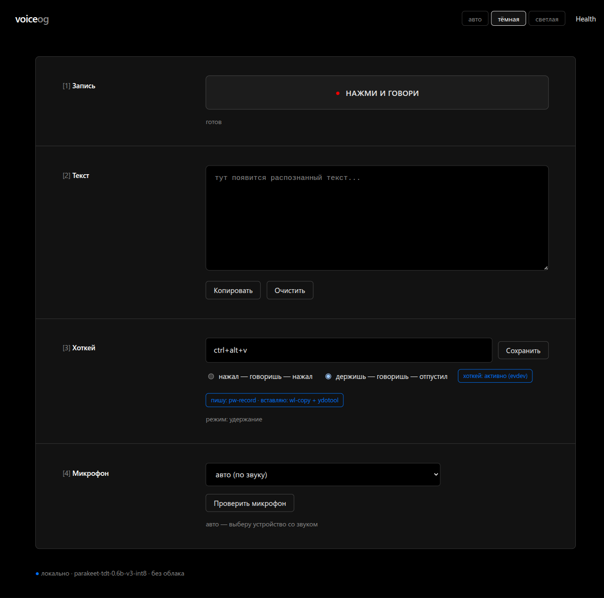
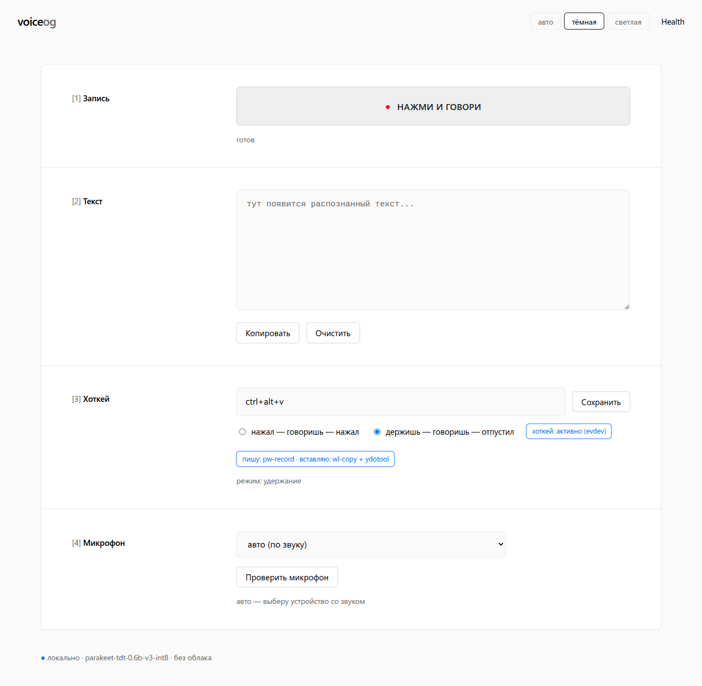

<p align="center">
  
</p>

<p align="center">
  
  
  
  
</p>

**Мини-локальный голосовой ввод.** Жмёшь кнопку (или хоткей) — говоришь — текст
падает куда надо. Без облака, без аккаунтов, без агентов. Речь → текст на своей
машине.

<p align="center">
  
  <br>
  <sub>Морда: кнопка, текст, хоткей, микрофон. Тема — авто / тёмная / светлая.</sub>
</p>

<details>
<summary>Светлая тема</summary>
<p align="center">
  
</p>
</details>

> Почему это работает на разных Linux и как устроено внутри —
> в [docs/platform.md](docs/platform.md). Коротко: код сам находит рабочий способ
> (запись, вставку, хоткей) под то, что стоит в системе.

## Что внутри

- **Модель:** NVIDIA Parakeet TDT 0.6B v3 INT8 (25 языков, включая русский и украинский,
  язык определяется сам, пунктуация своя). Это STT/ASR, не LLM — для расшифровки
  большая языковая модель не нужна.
- **Движок:** `sherpa-onnx` (Node-аддон, CPU, int8).
- **UI:** одна HTML-страница, микрофон через Web Audio, отправка PCM 16 кГц моно.
  Тема — **авто / тёмная / светлая**, переключается прямо в шапке и запоминается.
  Оформление — в духе Vercel Geist ([docs/design.md](docs/design.md)).
- **Диктовка:** глобальный хоткей, запись в фоне, автовставка текста в активное
  окно. Всё выбирается по возможностям системы, а не по дистрибутиву: запись —
  `pw-record` → `parec` → `arecord` → `ffmpeg`; вставка — буфер (`wl-copy` /
  `xclip`) + `Ctrl+V` (`ydotool` / `dotool` / `wtype` / `xdotool`). Хоткей — `evdev`
  (работает на любом десктопе, X11 и Wayland).

```
два пути ввода:

1) браузер:  микрофон → 16 кГц моно PCM → POST /transcribe → textarea
2) хоткей:   запись (pw-record/parec/arecord) → POST /toggle → STT → буфер + Ctrl+V → активное окно
```

## Запуск

```bash
./voiceog
```

Первый запуск сам поставит зависимости и скачает модель (архив ~487 МБ,
распаковывается в ~641 МБ на диске).
Дальше открываешь http://127.0.0.1:7777, жмёшь микрофон, говоришь, жмёшь ещё раз.

## Windows

Проект работает и под Windows. Ядро (распознавание, страница, HTTP-API)
кроссплатформенное, а системная обвязка вынесена в `src/platform/` — под Windows
это отдельные адаптеры, Linux-путь не тронут.

Что чем заменено на Windows:

| Задача | Linux | Windows |
|---|---|---|
| запись с микрофона | `pw-record` | `ffmpeg` (`-f dshow`), бинарь идёт в комплекте (`ffmpeg-static`) |
| вставка в окно | `wl-copy` + `ydotool` | `Set-Clipboard` + `SendKeys('^v')` (PowerShell) |
| глобальный хоткей | `evdev` | `uiohook-napi` (`keydown`+`keyup`, работает режим *hold*) |
| запасной хоткей ОС | GNOME `gsettings` | не нужен |

Запуск и управление (двойной клик или из консоли):

```bat
voiceog.cmd            :: старт сервера (поставит зависимости и модель)
voiceog.cmd toggle     :: старт/стоп записи (это же дёргает хоткей)
voiceog.cmd status     :: состояние
```

Требования: Node 20+ и PowerShell (есть в любой Windows). FFmpeg тащить
отдельно не надо — он уже в зависимостях.

> **Важно про npm.** Свежие npm (11+) по умолчанию блокируют install-скрипты
> пакетов, а `uiohook-napi` и `ffmpeg-static` без них не поставят свои бинарники.
> Если после `npm install` хоткей/запись не работают — выполни один раз:
>
> ```bat
> npm rebuild uiohook-napi ffmpeg-static
> ```

Микрофон: по умолчанию voiceog **сам выбирает устройство со звуком** (перебирает
аудио-устройства и берёт то, где реальный сигнал — иначе легко нарваться на
«мёртвый» микрофон и писать тишину). Своё устройство можно задать в морде, блок
**[4] Микрофон**, или переменной `VOICEOG_AUDIO_DEVICE` (имя как в списке
DirectShow). Там же кнопка **«Проверить микрофон»** — пишет 1,5 с и показывает
уровень и распознанный текст, сразу видно, слышит он или нет. Свой ffmpeg — `VOICEOG_FFMPEG`.

Автозапуск при входе (сервер поднимается **скрытно**, без окна консоли):

```powershell
powershell -ExecutionPolicy Bypass -File scripts\install-autostart.ps1
# снять:
powershell -ExecutionPolicy Bypass -File scripts\install-autostart.ps1 -Remove
```

Задача в автозагрузке зовёт `scripts\run-hidden.vbs`, а тот тихо запускает
`voiceog.cmd` — окно не мигает. Это per-user, **без прав администратора**.

Ограничения, честно: текст вставляется через буфер обмена (текущий буфер
перезапишется), и в окна, запущенные от имени администратора, вставка не пройдёт
(защита UIPI) — запускай VOICEog тем же уровнем прав, что и целевое окно.

## Окно-пульт и упаковка

Раньше морда жила во вкладке браузера, теперь есть **нативное окно** `window/`
(Rust: `tao` + `wry` + трей). Морду не переписывали — окно показывает тот же
веб-интерфейс, что отдаёт сервер: свой размер, заголовок и иконка в трее, а
второй запуск не плодит окно, а будит уже открытое. Сервер (Node) — отдельно.

- Собрать, запустить, поставить в автозапуск — [docs/window.md](docs/window.md).
- Раздача: `.deb`, `.rpm`, AppImage, портативный бандл и Windows-`setup.exe` —
  [docs/packaging.md](docs/packaging.md).
- Что нового в релизе — [docs/release-notes-0.1.0.md](docs/release-notes-0.1.0.md).
- Ручная проверка окна по шагам (чек-лист) — [docs/qa-window.md](docs/qa-window.md).
- Хэши и размеры артефактов релиза — [docs/release-manifest-0.1.0.md](docs/release-manifest-0.1.0.md).
- Что делать, если не работает — [docs/troubleshooting.md](docs/troubleshooting.md).
- Как это живёт на Windows — [docs/windows.md](docs/windows.md).

## Диктовка по хоткею (любой Linux)

Хоткей и вставка работают не «под GNOME», а под то, что реально есть в системе:
код сам находит рабочий путь. Настраивать под свой дистрибутив ничего не надо.

Сначала посмотри, что уже готово:

```bash
./voiceog doctor
```

Доктор напечатает: сессия (Wayland/X11), чем пишем, чем вставляем, есть ли доступ
к клавиатуре, поставлен ли автозапуск. Чего не хватает — скажет прямо.

Что выбирается автоматически (берётся первый рабочий):

| Задача | Порядок |
|---|---|
| запись | `pw-record` → `parec` → `arecord` → `ffmpeg` |
| буфер | Wayland: `wl-copy` · X11: `xclip` → `xsel` |
| вставка | `ydotool` → `dotool` → `wtype` (Wayland) · `xdotool` (X11) |
| хоткей | `evdev` (любой десктоп) → биндинг GNOME (запасной) |

Три шага, чтобы включить:

```bash
# 1. доступ к клавиатуре (/dev/input) и синтетическим нажатиям (/dev/uinput)
bash scripts/install-input-access.sh

# 2. поставить инструменты вставки, если доктор просит
#    Wayland: wl-clipboard + ydotool    X11: xclip + xdotool
#    (dnf install / apt install / pacman -S / zypper in)

# 3. автозапуск при входе
bash scripts/install-autostart.sh
```

После этого: нажал **Ctrl+Alt+V** → заговорил → нажал ещё раз → текст сам
вставился в активное окно.

> Почему буфер + Ctrl+V: набрать кириллицу «по клавишам» нельзя — раскладку не
> обойти. Поэтому текст кладётся в буфер и вставляется через Ctrl+V — так любой
> язык. `ydotool`/`dotool` эмулируют нажатия через `uinput` и работают на любом
> композиторе и на X11. `wtype` печатает Unicode сам, но только на wlroots
> (Sway/Hyprland/River/Niri) — GNOME и KDE этот протокол не реализуют.

## Хоткей и режимы — из веб-морды

В морде (`http://127.0.0.1:7777`) есть блок **[3] Хоткей**:

- **Комбинация** — жмёшь поле и набираешь своё сочетание, оно ловится и сохраняется.
- **Режим**:
  - *нажал — говоришь — нажал* (`toggle`) — как было: первое нажатие старт, второе стоп.
  - *держишь — говоришь — отпустил* (`hold`, push-to-talk) — пишет, пока держишь комбо.
- Настройки лежат в `voiceog.config.json` рядом с проектом и подхватываются сами. Шаблон-пример — `voiceog.config.example.json` (скопируй и правь под себя).
- **Тема** — кнопки в шапке: *авто* (как в системе), *тёмная*, *светлая*. Тоже
  сохраняется в конфиг, а для мгновенного применения дублируется в `localStorage`.

Для режима **hold** (держишь — говоришь — отпустил) нужен прямой доступ к
клавиатуре: GNOME-хоткей умеет только «нажал», а «отпустил» — нет, зато умеет
`evdev`. Это тот же `install-input-access.sh` из шага 1 выше — он ставит
udev-правила (первый раз требует sudo).

Когда доступ есть — хоткей читает клавиатуру сам (evdev) на любом десктопе, а
GNOME-биндинг гасится, чтобы не срабатывало дважды. Нет доступа — включается
запасной путь через GNOME (только режим *toggle*), а морда честно об этом пишет.

### Автозапуск

```bash
bash scripts/install-autostart.sh            # поставить
bash scripts/install-autostart.sh --remove   # снять
```

Это XDG `.desktop` в `~/.config/autostart` — понимают GNOME, KDE, XFCE, MATE,
Cinnamon и др., на X11 и на Wayland, и он не требует systemd. Нужен сервис с
перезапуском и systemd есть — есть и `scripts/install-service.sh`.

## Ручками

```bash
npm install            # зависимости
npm run model          # только скачать модель
npm start              # сервер
./voiceog toggle       # старт/стоп записи (это и дёргает хоткей)
./voiceog status       # состояние: пишет ли, готова ли вставка
./voiceog doctor       # что есть в системе: запись, вставка, права, автозапуск
```

Переменные:

- `VOICEOG_PORT` — порт (по умолчанию 7777)
- `VOICEOG_HOST` — адрес (по умолчанию 127.0.0.1, наружу не торчит)
- `VOICEOG_THREADS` — число потоков CPU (по умолчанию 4)
- `VOICEOG_MODEL` — путь к папке модели, если положил в другое место
- `VOICEOG_RECORDER` — своя команда записи. Голое имя (`parec`) берёт аргументы из
  цепочки, с аргументами — используется как есть. По умолчанию — `pw-record`
- `VOICEOG_NO_INJECT=1` — не вставлять текст в окно (серверный режим)

## HTTP

- `GET /` — морда
- `GET /health` — `{ok, model}`
- `GET /state` — `{recording, inject, model}`
- `POST /toggle` — старт/стоп записи; на стопе отдаёт `{recording:false, text, ms, injected}`
- `POST /transcribe` — принять WAV или сырой PCM 16 кГц моно, вернуть `{text, ms}`
- `POST /v1/audio/transcriptions` — **Whisper-совместимо** (multipart `file`), любой формат
  (ogg/opus/mp3/m4a/wav) → `{text}`. Сюда можно направить любой клиент, ждущий Whisper-API.

### Локальный STT для Telegram-бота

VOICEog умеет прикинуться Whisper-API — тогда голосовые в Телеге распознаются локально,
без облака. В `.env` бота:

```
STT_API_URL=http://127.0.0.1:7777/v1
STT_API_KEY=local
STT_MODEL=parakeet-tdt-0.6b-v3
```

## Проверка без браузера

```bash
curl -s http://127.0.0.1:7777/health
curl -s --data-binary @sample.wav http://127.0.0.1:7777/transcribe   # WAV
```

Сервер понимает и WAV (`RIFF`), и сырой PCM 16 кГц моно.

## Файлы

```
src/stt.mjs             обёртка над sherpa-onnx (модель, декод, разбор WAV)
src/server.mjs          http-сервер: /, /health, /state, /toggle, /transcribe, /api/*
src/doctor.mjs          ./voiceog doctor — что есть в системе
src/keys.mjs            раскладка: комбинация ↔ evdev-коды и GNOME-строка
src/settings.mjs        настройки (хоткей, режим) в voiceog.config.json
src/evdev.mjs           слушатель клавиатуры из /dev/input (хоткей, удержание)
src/gnome.mjs           GNOME-биндинг (запасной хоткей)
src/platform/           фасад под ОС
  linux/detect.mjs      что есть в системе: сессия, доступ к вводу
  linux/recorder.mjs    запись: pw-record → parec → arecord → ffmpeg
  linux/inject.mjs      вставка: буфер + Ctrl+V (wl-copy/xclip + ydotool/dotool/wtype/xdotool)
  win/...               Windows-адаптеры (ffmpeg dshow, Set-Clipboard, uiohook)
public/index.html       морда: кнопка, статус, textarea, настройки
scripts/                download-model(.sh/.mjs), install-autostart.sh, install-service.sh,
                        install-input-access.sh, setup-hotkey.sh, *.ps1/vbs (Windows)
voiceog / voiceog.cmd   лаунчер + CLI (toggle / status / doctor) под Linux / Windows
models/                 модель (в git не летит)
```